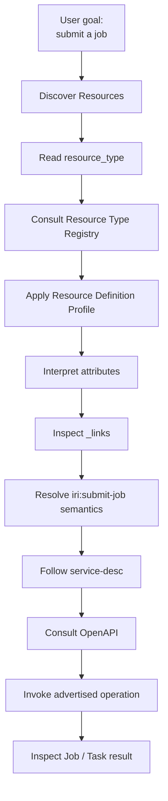

# IRI Agentic Discovery

One of the major benefits of the IRI Resource architecture is that a generic
agent can discover facility capabilities progressively instead of relying on
hard-coded API topology or speculative URL construction.

This page shows how `resource_type`, Resource Definition Profiles,
type-specific `attributes`, `_links`, relation definitions, and OpenAPI work
together for agentic workflows.

---

## 1. The Problem with Path Guessing

Suppose an agent is asked:

> Find an available compute system and submit a job.

Without explicit semantic discovery, the agent might know:

```text
Resource id = frontier
Resource appears to be compute
```

and guess:

```text
POST /api/v2/compute/jobs/frontier
```

That is unsafe architecture.

A facility may expose a different path, may not support the operation for that
Resource, or may filter the operation based on authorization.

The agent should operate from what the current representation advertises.

---

## 2. Discovery Flow



---

## 3. Step 1 — Discover Resources

The agent starts with the Status Resource API.

For example:

```text
GET /api/v2/status/resources
```

The API supports filtering by Resource Type URN.

A client can therefore search for compute Resources semantically rather than
looking for facility-specific names.

Example classification:

```text
urn:doe-iri:resource:compute
```

may be used as a parent classification according to the Resource Type filtering
rules in the current OpenAPI.

---

## 4. Step 2 — Read `resource_type`

Suppose the returned Resource contains:

```json
{
  "id": "frontier",
  "resource_type": "urn:doe-iri:resource:compute:system"
}
```

The agent now knows:

```text
WHAT KIND of Resource this is
```

without inferring from:

- its name;
- URL;
- vendor;
- facility documentation;
- previous prompts.

---

## 5. Step 3 — Resolve the Resource Definition Profile

The Resource Type Registry maps the Resource Type to its semantic profile.

For example:

```text
urn:doe-iri:resource:compute:system
```

maps to:

```text
https://iri.science/profiles/resource-definition/compute/system
```

The profile tells the agent how to interpret type-specific information.

The agent should not construct the profile URI mechanically from the URN unless
that exact mapping is registered.

---

## 6. Step 4 — Interpret `attributes`

A compute Resource can advertise compute-specific characteristics inside:

```text
attributes
```

The Resource Definition Profile defines the meaning and allowed value families.

This lets the agent reason about things such as:

```text
architecture
configured capabilities
node characteristics
accelerator characteristics
implementation details
```

without forcing those properties into every IRI Resource representation.

Controlled values can use DOE-IRI URNs so equivalent concepts have stable
machine-readable identifiers across facilities.

---

## 7. Step 5 — Inspect `_links`

The agent then looks at the links actually advertised by the Resource.

For example:

```json
{
  "_links": {
    "self": {
      "href": "https://api.example.org/api/v2/status/resources/frontier",
      "profile":
        "https://iri.science/profiles/resource-definition/compute/system"
    },

    "iri:has-node": [
      {
        "href":
          "https://api.example.org/api/v2/status/resources/frontier-node-1",
        "profile":
          "https://iri.science/profiles/resource-definition/compute/node"
      }
    ],

    "iri:submit-job": {
      "href":
        "https://api.example.org/api/v2/compute/job/frontier"
    },

    "service-desc": {
      "href": "https://api.example.org/openapi.json"
    }
  }
}
```

The agent does not need to guess these paths.

---

## 8. Step 6 — Interpret Relation Semantics

The Link Relation Registry tells the agent what each relation means.

For example:

```text
iri:has-node
    topology relationship

iri:submit-job
    applicable job-submission operation entry point
```

The agent can distinguish:

```text
Resource target
operation target
service-description target
```

before deciding how to use the link.

---

## 9. Step 7 — Use `service-desc`

The agent can follow:

```text
service-desc
```

to retrieve the applicable OpenAPI specification.

Now it has the structural contract needed to invoke the operation.

This provides the layered model:

```text
iri:submit-job
    WHICH operation is applicable?

href
    WHERE is that entry point?

service-desc
    WHERE is the API contract?

OpenAPI
    HOW do I invoke it?
```

---

## 10. Step 8 — Invoke Deterministically

After consulting OpenAPI, the agent can determine:

```text
HTTP method
request body schema
parameters
security requirements
response schema
error responses
```

Only then should it invoke the operation.

This separates LLM reasoning from protocol facts.

---

## 11. Step 9 — Follow the Result

If an operation returns a `Job`, the Job is an independently meaningful
representation with profile:

```text
https://iri.science/profiles/compute/job
```

If asynchronous monitoring is represented through a Task, a submit response may
use:

```text
monitor
```

to identify the Task.

The Task representation itself can use:

```text
self
```

for its canonical identity.

---

## 12. Agent Knowledge vs Runtime Discovery

An agent may know general IRI semantics from documentation or RAG.

However:

```text
stored knowledge
    tells the agent what a relation means

current representation
    tells the agent whether that relation is currently advertised

OpenAPI
    tells the agent how the current API is invoked
```

Cached or indexed links should not be treated as proof of:

- current authorization;
- availability;
- schedulability;
- current endpoint location;
- current applicability.

The agent should inspect the current Resource representation before acting.

---

## 13. Benefits for MCP and Tool-Calling Agents

The architecture is well suited to an MCP or constrained-tool environment.

A tool can expose operations such as:

```text
list_resources
get_resource
follow_link
get_service_description
submit_job
get_task
```

The agent uses semantic information to decide which deterministic tool call is
appropriate.

This limits the amount of API topology that must be embedded into prompts.

---

## 14. Reduction in Prompt Knowledge

Without hypermedia:

```text
Prompt / SDK must know:
- facility routing
- compute path convention
- storage path convention
- operation path convention
- relationship path construction
```

With semantic discovery:

```text
Prompt / agent needs to know:
- how to interpret IRI Resource Types
- how to interpret registered relations
- when to consult the current representation
- when to consult OpenAPI
```

Facility-specific locations remain in the representation itself.

---

## 15. A General Agentic Algorithm

```text
1. Discover representations through documented entry points.

2. Inspect the representation before inferring behavior.

3. For a Resource:
       read resource_type.

4. Resolve the registered semantic profile when needed.

5. Interpret attributes using that profile.

6. Inspect _links for topology, related objects, operation affordances,
   and service descriptions.

7. Interpret iri:* names using the Link Relation Registry.

8. Never construct an operational URL solely from resource_type or id.

9. For an operation:
       follow the advertised operation href;
       consult service-desc / OpenAPI;
       validate method, body, security, and expected response.

10. Invoke the operation through a deterministic tool/API layer.

11. Follow returned Job/Task representations using their advertised links.

12. Re-read current representations when authorization, topology, or
    applicability may have changed.
```

---

## 16. Architectural Outcome

The Resource becomes more than a status record.

It becomes a machine-readable description of:

```text
identity
classification
semantic characteristics
relationships
topology
capabilities
operation entry points
service contract discovery
```

This is the key benefit for agentic IRI workflows:

> The agent can progressively discover what a facility exposes and how to use
> it, rather than relying on guessed paths or facility-specific prompt logic.

---

See also:

- [IRI Architecture](architecture.md)
- [IRI API URL Structure](api-url-structure.md)
- [IRI Semantic Registry Architecture](semantic-registry-architecture.md)
