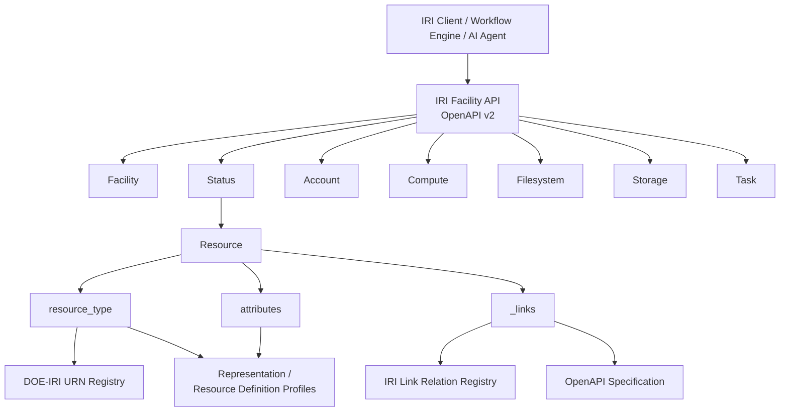
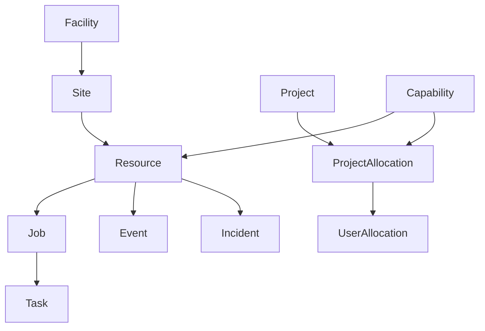
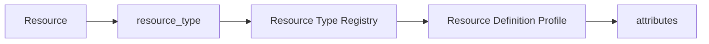
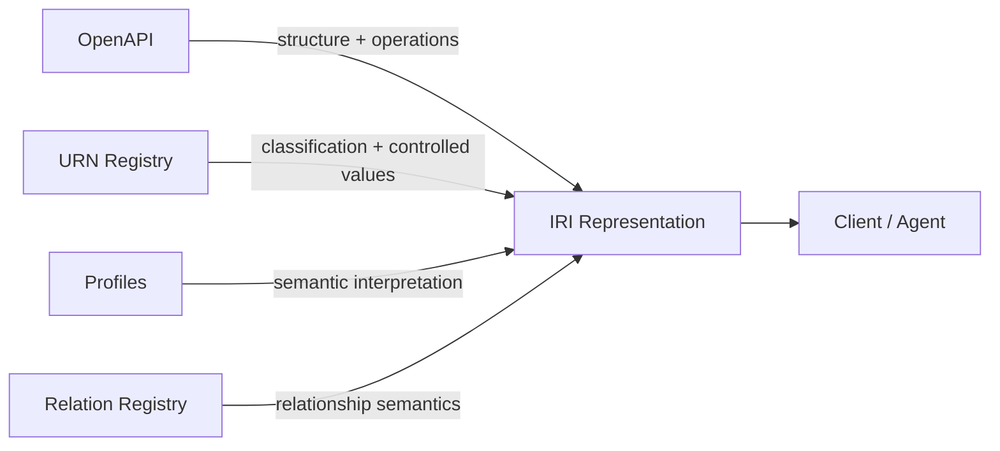

# IRI Facility API Architecture

The DOE Integrated Research Infrastructure (IRI) Facility API provides a common
way for independently operated facilities to describe resources, expose
relationships, advertise capabilities, and provide operation entry points.

The architecture intentionally separates four concerns:

```text
OpenAPI
    defines the structural API contract

Resource Type URNs
    classify what kind of Resource is represented

Representation / Resource Definition Profiles
    define semantic interpretation

HAL _links and registered link relations
    make relationships and applicable operations navigable
```

This separation allows the common API model to remain stable while facilities
describe heterogeneous compute, storage, service, network, and future resource
types in an extensible and machine-readable way.

For detailed companion pages, see:

- [IRI API URL Structure](api-url-structure.md)
- [IRI Object Model Reference](object-model-reference.md)
- [IRI Semantic Registry Architecture](semantic-registry-architecture.md)
- [IRI Agentic Discovery](agentic-discovery.md)

---

## 1. Architectural Goals

The IRI Facility API must support facilities that:

- expose very different kinds of infrastructure;
- organize their internal URLs differently;
- evolve their resource taxonomy over time;
- expose different relationships and operations;
- need interoperable semantics without continually expanding one common JSON
  schema.

The resulting design should let a generic client answer:

```text
What is this object?
What kind of Resource is it?
What properties are common to all Resources?
What type-specific characteristics does it have?
What other representations is it related to?
What operations are applicable?
Where are those representations and operations located?
How should an advertised operation be invoked?
```

The architecture maps those questions to explicit contracts instead of requiring
clients to infer the answers.

---

## 2. High-Level Architecture



The OpenAPI specification is currently maintained as modular v2 YAML organized
by functional domain, with shared components in `_components.yaml` and a merged
`all_spec_v2.yaml` artifact.

---

## 3. API URL Organization

IRI v2 organizes its HTTP interface under:

```text
/api/v2/
```

with the next path segment identifying an API domain.

Conceptually:

```text
/api/v2/<domain>/<collection>/<identifier>
```

Some objects, such as the Facility representation, are singleton resources and
do not require a collection identifier.

Examples from the current v2 OpenAPI include:

```text
GET /api/v2/facility
GET /api/v2/facility/sites
GET /api/v2/facility/sites/{site_id}

GET /api/v2/status/resources
GET /api/v2/status/resources/{resource_id}

GET /api/v2/status/incidents
...
```

The current production OpenAPI is modularized into these domain files:

```text
facility.yaml
status.yaml
account.yaml
compute.yaml
filesystem.yaml
storage.yaml
task.yaml
_components.yaml
```

See [IRI API URL Structure](api-url-structure.md) for the detailed URL model.

### Important architectural rule

The URL structure organizes the HTTP API. It is **not** the semantic Resource
taxonomy.

A client MUST NOT assume that a Resource Type URN can be converted into an API
path.

For example:

```text
urn:doe-iri:resource:compute:system
```

identifies the kind of Resource. It does not tell a client where job submission
is located.

Navigation and applicable operation entry points are advertised through
`_links`.

---

## 4. Primary API Representations

The v2 API contains several independently meaningful representation types.



This diagram is conceptual rather than a statement that every arrow is a
single registered link relation.

The major representations include:

| Representation | Architectural role |
|---|---|
| `Facility` | Describes the facility as an IRI provider. |
| `Site` | Describes a facility site and the Resources associated with it. |
| `Resource` | Common representation for physical, logical, virtual, and service-oriented infrastructure. |
| `Incident` | Represents a service or resource-affecting incident. |
| `Event` | Represents an event associated with a Resource and optionally an Incident. |
| `Capability` | Describes an allocatable or usable facility capability. |
| `Project` | Represents a project recognized by the facility. |
| `ProjectAllocation` | Associates project allocation with a capability. |
| `UserAllocation` | Associates a user with a project allocation. |
| `Job` | Represents compute job submission and job state. |
| `Task` | Tracks asynchronous API work or results. |

Not every OpenAPI component is an independently identifiable IRI
representation. Request bodies, helper objects, enums, nested attribute
structures, and Problem Details remain important OpenAPI schemas but do not
automatically require their own identity, profile, Resource Type, or link
relation.

See [IRI Object Model Reference](object-model-reference.md).

---

## 5. The Common Resource Model

`Resource` is the central extensibility point of the IRI architecture.

A simplified Resource can be viewed as:

```json
{
  "id": "frontier",
  "name": "Frontier",
  "current_status": "available",

  "resource_type": "urn:doe-iri:resource:compute:system",

  "attributes": {
    "schema_version": "1.0.0"
  },

  "_links": {
    "self": {
      "href": "https://api.example.org/api/v2/status/resources/frontier",
      "type": "application/hal+json",
      "profile": "https://iri.science/profiles/resource-definition/compute/system"
    }
  }
}
```

The architecture assigns separate roles to the major parts:

```text
id / self
    WHICH Resource is this?

resource_type
    WHAT KIND of Resource is this?

attributes
    WHAT TYPE-SPECIFIC DATA is advertised?

_links
    WHAT is related or applicable and WHERE is it?

OpenAPI
    HOW is the API structurally represented and invoked?
```

---

## 6. `resource_type`

`resource_type` carries a registered DOE-IRI Resource Type URN.

Examples include:

```text
urn:doe-iri:resource:compute:system
urn:doe-iri:resource:compute:node
urn:doe-iri:resource:compute:cpu
urn:doe-iri:resource:compute:gpu

urn:doe-iri:resource:storage:system
urn:doe-iri:resource:storage:filesystem
urn:doe-iri:resource:storage:mount
urn:doe-iri:resource:storage:block
urn:doe-iri:resource:storage:object

urn:doe-iri:resource:service:dtn
urn:doe-iri:resource:service:inference
```

The DOE-IRI URN Registry is authoritative for assigned Resource Type URNs.

The hierarchy is a **semantic classification hierarchy**, not a physical
containment hierarchy.

For example:

```text
urn:doe-iri:resource:compute:system
urn:doe-iri:resource:compute:node
```

do not imply their topology solely from the URN hierarchy. The relationship
between the system and node is represented using a registered link relation
such as `iri:has-node`.

---

## 7. Resource-Specific `attributes`

The common `Resource` schema cannot contain every property required by every
future compute, storage, network, data-transfer, inference, or other Resource.

IRI therefore uses:

```text
attributes
```

as the container for type-specific Resource information.

The meaning of those attributes is supplied by the Resource Definition Profile
registered for the Resource's exact `resource_type`.

Conceptually:



A Resource Definition Profile supplements the common Resource representation.
It does not define a separate Resource Definition API object in IRI v2.

For example:

```text
resource_type
    urn:doe-iri:resource:storage:filesystem

Resource Definition Profile
    https://iri.science/profiles/resource-definition/storage/filesystem
```

The profile can define the semantic meaning of filesystem-specific attributes,
including which controlled DOE-IRI URNs are valid values.

---

## 8. `_links`

`_links` provides machine-readable navigation and operation discovery.

The design uses HAL-style Link Objects.

A typical link contains:

```json
{
  "iri:has-mount": {
    "href": "https://api.example.org/api/v2/status/resources/example-mount",
    "type": "application/hal+json",
    "profile": "https://iri.science/profiles/resource-definition/storage/mount"
  }
}
```

The four layers are distinct:

```text
relation
    WHY is the target linked?

href
    WHERE is the target?

type
    HOW is the target represented?

profile
    WHAT semantic representation contract applies to the target?
```

The link relation and target representation profile MUST NOT be conflated.

The registered relation definition specifies semantics such as:

- source representation;
- target representation;
- cardinality;
- target classification;
- visibility behavior;
- stability/volatility;
- omission semantics.

---

## 9. Operation Discovery

Relationships and operations use the same basic hypermedia mechanism but have
different target classifications.

For example:

```json
{
  "_links": {
    "iri:submit-job": {
      "href": "https://api.example.org/api/v2/compute/job/frontier"
    },
    "service-desc": {
      "href": "https://api.example.org/openapi.json",
      "type": "application/json"
    }
  }
}
```

Here:

```text
iri:submit-job
    identifies WHICH operation entry point is applicable

href
    identifies WHERE that entry point is located

service-desc
    identifies WHERE the machine-readable service contract can be found

OpenAPI
    defines HOW to invoke the operation
```

The link does not itself define the HTTP method, request body, security model,
response contract, or error model.

Those remain OpenAPI responsibilities.

---

## 10. Documentation Architecture

IRI deliberately separates documentation authority by concern.



| Source | Primary question answered |
|---|---|
| OpenAPI | What JSON fields and API operations exist? |
| Resource Type URN Registry | What kind of Resource is this? |
| Controlled Attribute URN Registry | What does this standardized attribute value mean? |
| Representation Profile | What additional semantic contract applies to this representation? |
| Resource Definition Profile | What type-specific semantics apply to this Resource? |
| Link Relation Registry | Why is the target related or applicable? |
| `_links.href` | Where is the target? |
| `service-desc` | Where is the machine-readable operation contract? |

See [IRI Semantic Registry Architecture](semantic-registry-architecture.md).

---

## 11. Why the Architecture Is Structured This Way

### 11.1. Extensibility

New Resource Types can be added without continually expanding the common
`Resource` schema.

### 11.2. Facility independence

Facilities are free to implement different routing structures while advertising
actual relationships and operation entry points.

### 11.3. Semantic interoperability

URNs and profiles give clients a stable vocabulary independent of a particular
facility implementation.

### 11.4. Discoverability

`_links` makes topology and capabilities navigable instead of requiring
out-of-band URL construction.

### 11.5. Clear authority boundaries

OpenAPI, registries, profiles, and link-relation definitions each own one class
of concern, reducing duplication and semantic ambiguity.

### 11.6. Agentic safety and determinism

Agents do not need to infer or hallucinate likely paths. They can inspect the
current representation, follow advertised relations, and consult OpenAPI before
invoking an operation.

---

## 12. Agentic View of an IRI Facility

For an agent, the Resource representation can be treated as a machine-readable
capability map.

```text
discover Resource
    ↓
read resource_type
    ↓
understand semantic class
    ↓
apply Resource Definition Profile
    ↓
interpret attributes
    ↓
inspect _links
    ↓
discover topology / capabilities / operations
    ↓
follow service-desc
    ↓
consult OpenAPI
    ↓
invoke the applicable operation
```

This model reduces dependence on:

- hard-coded paths;
- facility-specific SDK logic;
- prompt-encoded API topology;
- static documentation lookup;
- speculative URL construction.

See [IRI Agentic Discovery](agentic-discovery.md).

---

## 13. Authoritative Repository Sources

This site is explanatory. The repository remains authoritative.

- OpenAPI v2:
  [`specification-v2/openapi/`](https://github.com/doe-iri/iri-facility-api-docs/tree/main/specification-v2/openapi)
- Resource Type and controlled URN registries:
  [`registry/urns/`](https://github.com/doe-iri/iri-facility-api-docs/tree/main/registry/urns)
- Representation and Resource Definition Profiles:
  [`registry/profiles/`](https://github.com/doe-iri/iri-facility-api-docs/tree/main/registry/profiles)
- Link Relation Registry:
  [`registry/relations/`](https://github.com/doe-iri/iri-facility-api-docs/tree/main/registry/relations)
- HAL architecture:
  [`rfc/rfc-hal-links.md`](https://github.com/doe-iri/iri-facility-api-docs/blob/main/rfc/rfc-hal-links.md)
- Resource-specific attributes and profiles:
  [`rfc/rfc-type-specific-attributes.md`](https://github.com/doe-iri/iri-facility-api-docs/blob/main/rfc/rfc-type-specific-attributes.md)

Repository:

[doe-iri/iri-facility-api-docs](https://github.com/doe-iri/iri-facility-api-docs)

---

*DOE Integrated Research Infrastructure — Facility API Architecture*
