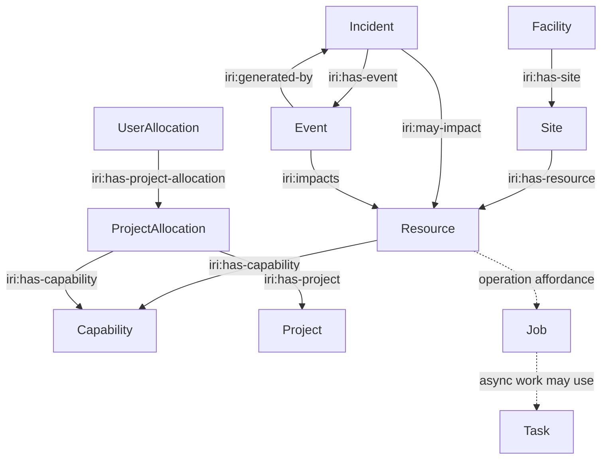

# IRI Object Model Reference

This page provides an architectural view of the principal representation types
defined by the IRI Facility API v2.

It is not intended to duplicate every OpenAPI property. The OpenAPI
specification remains authoritative for exact property names, types,
requiredness, formats, request bodies, and response schemas.

---

## 1. Object Categories

OpenAPI contains several kinds of schemas.

```text
Independent API representations
    Facility, Site, Resource, Incident, Event, Capability, Project,
    ProjectAllocation, UserAllocation, Job, Task

Resource specialization
    Resource + resource_type + Resource Definition Profile + attributes

Operation request/response objects
    Job specifications, filesystem/storage requests, submit responses, etc.

Supporting schemas
    enums, Problem Details, nested values, reusable helper structures
```

Only independently meaningful representations need architectural identity and
representation profiles by default.

A helper schema does not become an IRI Resource merely because it appears under
`components/schemas`.

---

## 2. Representation Relationships



The registered relation definitions remain authoritative for exact source,
target, cardinality, visibility, and stability semantics.

---

# 3. Facility

## Purpose

Represents the facility exposing the IRI API.

## API role

The Facility is a singleton top-level representation:

```text
GET /api/v2/facility
```

## Profile

```text
https://iri.science/profiles/facility
```

## Architectural responsibilities

The Facility provides facility-level metadata and navigation, including access
to associated Sites and support information.

Typical navigation includes:

```text
iri:has-site
help
self
service-desc
```

where applicable.

---

# 4. Site

## Purpose

Represents a facility Site.

## API role

Current v2 examples include:

```text
GET /api/v2/facility/sites
GET /api/v2/facility/sites/{site_id}
```

## Profile

```text
https://iri.science/profiles/facility/site
```

## Architectural responsibilities

A Site provides an organizational/physical context for IRI Resources.

A Site can advertise:

```text
iri:has-resource
```

to navigate to Resources associated with the Site.

A Resource can advertise:

```text
iri:located-at
```

to navigate back to its associated Site.

---

# 5. Resource

## Purpose

`Resource` is the common representation for physical, logical, virtual, and
service-oriented infrastructure exposed by a facility.

## API role

Current v2 examples include:

```text
GET /api/v2/status/resources
GET /api/v2/status/resources/{resource_id}
```

## Common profile

```text
https://iri.science/profiles/status/resource
```

## Core architectural properties

| Concept | Role |
|---|---|
| `id` | Facility-local instance identity. |
| `name` / `description` | Human-readable metadata. |
| `current_status` | Current Resource status according to the common Resource contract. |
| `resource_type` | Registered semantic Resource classification. |
| `attributes` | Type-specific data interpreted using the applicable Resource Definition Profile. |
| `_links` | Related Resources, topology, capabilities, operations, and service descriptions. |

## Specialization

```text
Resource
    +
resource_type
    +
Resource Definition Profile
    +
attributes
```

allows one common API representation to describe heterogeneous infrastructure.

---

# 6. Incident

## Purpose

Represents an incident that may affect one or more IRI Resources.

## Profile

```text
https://iri.science/profiles/status/incident
```

## Important relations

```text
iri:has-event
iri:may-impact
```

The Incident expresses the broader condition; Events capture individual event
records associated with it.

---

# 7. Event

## Purpose

Represents an event applying to a Resource, optionally associated with an
Incident.

## Profile

```text
https://iri.science/profiles/status/event
```

## Important relations

```text
iri:impacts
iri:generated-by
```

`iri:impacts` identifies the Resource to which the Event applies.

`iri:generated-by` identifies the Incident with which the Event is associated,
when present.

---

# 8. Capability

## Purpose

Represents a facility capability that may be associated with Resources and
allocations.

## Profile

```text
https://iri.science/profiles/account/capability
```

## Important relation use

A Resource can expose:

```text
iri:has-capability
```

A `ProjectAllocation` can use the same semantic relation to identify the
Capability to which that allocation applies.

---

# 9. Project

## Purpose

Represents a project recognized by the facility/accounting model.

## Profile

```text
https://iri.science/profiles/account/project
```

## Relationship role

A `ProjectAllocation` identifies its Project using:

```text
iri:has-project
```

---

# 10. ProjectAllocation

## Purpose

Represents a project's allocation of a facility Capability.

## Profile

```text
https://iri.science/profiles/account/project-allocation
```

## Important relations

```text
iri:has-project
iri:has-capability
```

This lets a client navigate from the allocation to both the Project and the
Capability to which the allocation applies.

---

# 11. UserAllocation

## Purpose

Represents the allocation context for a user within a ProjectAllocation.

## Profile

```text
https://iri.science/profiles/account/user-allocation
```

## Important relation

```text
iri:has-project-allocation
```

This preserves the allocation hierarchy as explicit navigation rather than
requiring URI construction.

---

# 12. Job

## Purpose

Represents a compute job and its lifecycle/state according to the current
compute API contract.

## Profile

```text
https://iri.science/profiles/compute/job
```

## Architectural distinction

The Job representation is not the same thing as the job-submission operation
entry point.

```text
iri:submit-job
    target = operation entry point

Job profile
    target = Job representation
```

A HAL link to a submit operation therefore does not use the Job representation
profile merely because invoking that operation produces a Job.

---

# 13. Task

## Purpose

Represents asynchronous API work or a result that can be monitored.

## Profile

```text
https://iri.science/profiles/task
```

## Navigation

A submit response can use the standard Web Linking relation:

```text
monitor
```

to identify the Task used to monitor asynchronous progress.

The Task representation itself can expose:

```text
self
```

for its canonical identity.

`monitor` and `self` have different semantics even if their `href` values happen
to be equal.

---

# 14. Resource Definition Types

The following are not separate OpenAPI top-level Resource classes. They are
semantic specializations of the common `Resource` representation.

## Compute

| Resource Type | Resource Definition Profile |
|---|---|
| `urn:doe-iri:resource:compute:system` | `https://iri.science/profiles/resource-definition/compute/system` |
| `urn:doe-iri:resource:compute:node` | `https://iri.science/profiles/resource-definition/compute/node` |
| `urn:doe-iri:resource:compute:cpu` | `https://iri.science/profiles/resource-definition/compute/cpu` |
| `urn:doe-iri:resource:compute:gpu` | `https://iri.science/profiles/resource-definition/compute/gpu` |

Topology is represented with relations such as:

```text
iri:has-node
iri:has-cpu
iri:has-gpu
```

## Storage

| Resource Type | Resource Definition Profile |
|---|---|
| `urn:doe-iri:resource:storage:system` | `https://iri.science/profiles/resource-definition/storage/system` |
| `urn:doe-iri:resource:storage:filesystem` | `https://iri.science/profiles/resource-definition/storage/filesystem` |
| `urn:doe-iri:resource:storage:mount` | `https://iri.science/profiles/resource-definition/storage/mount` |
| `urn:doe-iri:resource:storage:block` | `https://iri.science/profiles/resource-definition/storage/block` |
| `urn:doe-iri:resource:storage:object` | `https://iri.science/profiles/resource-definition/storage/object` |

Typical topology includes:

```text
storage system
    └── iri:provides-filesystem → filesystem
             └── iri:has-mount → mount
                      └── iri:mounted-on → compute system
```

Block storage can use:

```text
iri:attached-to
```

to identify consuming compute infrastructure.

## Services

| Resource Type | Resource Definition Profile |
|---|---|
| `urn:doe-iri:resource:service:dtn` | `https://iri.science/profiles/resource-definition/service/dtn` |
| `urn:doe-iri:resource:service:inference` | `https://iri.science/profiles/resource-definition/service/inference` |

Service topology can include:

```text
iri:hosted-on
iri:accesses-mount
```

A service Resource remains distinct from the compute infrastructure on which it
is hosted.

---

# 15. Supporting OpenAPI Schemas

The OpenAPI specification also defines schemas used to invoke operations or
compose representations.

Examples include categories such as:

```text
operation request bodies
operation response bodies
nested attribute/value objects
enums
pagination/filter structures
Problem Details
```

These schemas remain important structural contracts.

However:

> Presence under `components/schemas` does not automatically imply independent
> IRI identity.

A helper object generally should not receive:

```text
a Resource Type URN
a Resource Definition Profile
a self link
an IRI link relation
```

unless an interoperability use case requires independent identity, lifecycle,
navigation, or semantic constraints beyond the containing representation.

---

# 16. Where to Find Exact Details

| Question | Authority |
|---|---|
| Exact JSON fields/types | OpenAPI v2 |
| Exact paths/methods | OpenAPI v2 |
| Resource Type assignment | DOE-IRI Resource Type Registry |
| Controlled attribute values | DOE-IRI Controlled Attribute Registry |
| Common representation semantics | Representation Profile |
| Type-specific Resource semantics | Resource Definition Profile |
| Relation semantics | IRI Link Relation Registry |

Repository:

https://github.com/doe-iri/iri-facility-api-docs

See also:

- [IRI Architecture](architecture.md)
- [IRI Semantic Registry Architecture](semantic-registry-architecture.md)
