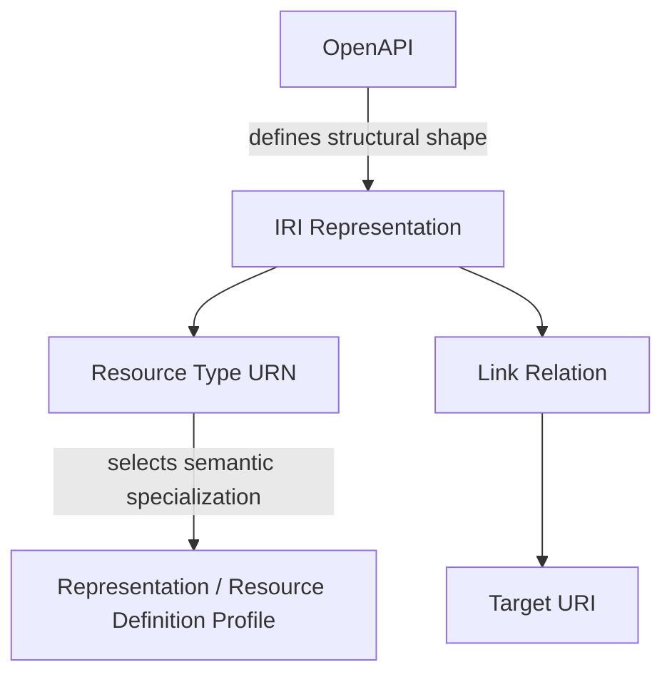

# IRI Semantic Registry Architecture

The IRI Facility API deliberately separates HTTP structure from semantic
meaning.

This page describes the roles of:

- the OpenAPI specification;
- the DOE-IRI URN Registry;
- Representation Profiles;
- Resource Definition Profiles;
- the IRI Link Relation Registry.

---

## 1. The Five-Layer View



Each layer answers a different question.

| Layer | Question |
|---|---|
| OpenAPI | What JSON fields and operations exist? |
| Resource Type URN | What kind of Resource is this? |
| Profile | What additional semantic contract applies? |
| Link relation | Why is this target related or applicable? |
| `href` | Where is the target? |

---

## 2. OpenAPI

OpenAPI is the structural API contract.

It defines:

- endpoint paths;
- HTTP methods;
- query/path parameters;
- request bodies;
- response bodies;
- JSON properties;
- types and formats;
- required/optional/nullability rules;
- structural validation;
- security contracts;
- error responses.

Profiles and registries do not replace OpenAPI.

---

## 3. DOE-IRI URN Registry

The DOE-IRI URN Registry records assigned semantic identifiers.

Important categories include:

```text
urn:doe-iri:resource:...
    Resource Type URNs

urn:doe-iri:storage:...
urn:doe-iri:compute:...
urn:doe-iri:service:...
    controlled attribute vocabularies

urn:doe-iri:allocation:...
    allocation-unit vocabulary
```

The URN hierarchy is semantic classification.

It does not express runtime topology.

Example:

```text
urn:doe-iri:resource:compute:node
```

means:

```text
This Resource is a compute node.
```

It does not mean:

```text
This node is physically nested beneath a compute-system URL.
```

Topology is expressed using `_links`.

---

## 4. Resource Type Registry

For a Resource:

```json
{
  "resource_type": "urn:doe-iri:resource:storage:filesystem"
}
```

the Resource Type Registry defines the recognized semantic type and records its
relationship to the applicable Resource Definition Profile when one exists.

Clients should not mechanically derive the profile URI from the Resource Type
URN.

The mapping is a registry concern.

---

## 5. Representation Profiles

A Representation Profile adds semantic and interoperability conventions to an
independently meaningful API representation.

Examples:

```text
https://iri.science/profiles/facility
https://iri.science/profiles/facility/site

https://iri.science/profiles/status/resource
https://iri.science/profiles/status/event
https://iri.science/profiles/status/incident

https://iri.science/profiles/account/capability
https://iri.science/profiles/account/project
https://iri.science/profiles/account/project-allocation
https://iri.science/profiles/account/user-allocation

https://iri.science/profiles/compute/job
https://iri.science/profiles/task
```

OpenAPI says:

```text
what fields exist
```

while a profile says:

```text
what those fields mean in an interoperable IRI context
```

---

## 6. Resource Definition Profiles

A Resource Definition Profile specializes the common IRI Resource representation
for an exact Resource Type.

Conceptually:

```text
OpenAPI Resource schema
        ↓
IRI Status Resource Profile
        ↓
resource_type
        ↓
Resource Type Registry
        ↓
Resource Definition Profile
        ↓
semantics of attributes and type-specific behavior
```

Examples:

```text
resource_type:
urn:doe-iri:resource:compute:system

profile:
https://iri.science/profiles/resource-definition/compute/system
```

and:

```text
resource_type:
urn:doe-iri:resource:storage:filesystem

profile:
https://iri.science/profiles/resource-definition/storage/filesystem
```

A Resource Definition Profile supplements the common Resource profile.

IRI v2 does not require a separate Resource Definition API representation.

---

## 7. Controlled Attribute URNs

A Resource Definition Profile may define a property whose value comes from a
controlled DOE-IRI vocabulary.

For example:

```json
{
  "resource_type": "urn:doe-iri:resource:storage:system",
  "attributes": {
    "schema_version": "1.0.0",
    "storage_technology":
      "urn:doe-iri:storage:system-technology:lustre"
  }
}
```

The roles are:

```text
storage_technology
    profile-defined JSON property

urn:doe-iri:storage:system-technology:lustre
    registered controlled semantic value
```

The profile defines which vocabulary applies to the property.

The URN Registry defines the meaning and lifecycle of the controlled value.

---

## 8. IRI Link Relation Registry

The Link Relation Registry defines every `iri:*` relation.

Examples include:

```text
iri:located-at
iri:has-resource
iri:has-capability

iri:provides-filesystem
iri:has-mount
iri:mounted-on
iri:attached-to

iri:has-node
iri:has-cpu
iri:has-gpu

iri:hosted-on
iri:accesses-mount

iri:submit-job
```

A relation definition records semantics such as:

- source type;
- target type;
- cardinality;
- target classification;
- visibility/authorization behavior;
- stability;
- omission semantics.

The relation registry answers:

```text
WHY is the target linked?
```

It does not identify the target instance.

That is the job of `href`.

---

## 9. Relation URI vs Profile URI

These are different identifiers.

```text
https://iri.science/rels/has-mount
    relation semantics

https://iri.science/profiles/resource-definition/storage/mount
    target representation semantics
```

Example:

```json
{
  "_links": {
    "iri:has-mount": {
      "href": "https://api.example.org/api/v2/status/resources/example-mount",
      "profile":
        "https://iri.science/profiles/resource-definition/storage/mount"
    }
  }
}
```

Interpretation:

```text
iri:has-mount
    WHY

href
    WHERE

profile
    WHAT semantic representation contract applies to the target
```

---

## 10. The Four-Layer HAL Link Model

A typical IRI HAL Link Object can expose:

```text
relation
href
type
profile
```

Their roles are:

```text
relation
    WHY is the target linked?

href
    WHERE is the target?

type
    HOW is the target encoded?

profile
    WHAT additional target semantics apply?
```

These layers let an agent reason about a target without conflating identity,
semantics, representation encoding, and relationship meaning.

---

## 11. Operation Links

An operation relation is different from a Resource-to-Resource relationship.

Example:

```text
iri:submit-job
```

targets an operation entry point.

It does not target the Job representation.

Therefore this would be conceptually wrong:

```text
iri:submit-job
    profile = compute/job
```

The Job profile describes a Job representation.

The operation link identifies the applicable job-submission entry point.

OpenAPI defines how to invoke that entry point.

---

## 12. `service-desc`

`service-desc` identifies a machine-readable service description.

In IRI this can be used to point to the applicable OpenAPI document.

```json
{
  "_links": {
    "service-desc": {
      "href": "https://api.example.org/openapi.json"
    }
  }
}
```

This lets a client separate:

```text
semantic discovery
    relations + profiles

from

operation invocation
    OpenAPI
```

---

## 13. Source-of-Truth Matrix

| Concern | Authoritative source |
|---|---|
| API path and method | OpenAPI |
| Property/type/requiredness | OpenAPI |
| Resource Type identifier | Resource Type URN Registry |
| Controlled semantic value | Controlled Attribute URN Registry |
| Common Resource semantics | Status Resource Profile |
| Type-specific Resource semantics | Resource Definition Profile |
| Link relation name | Link Relation Registry |
| Relation source/target/cardinality | Individual relation definition |
| Target instance location | HAL `href` |
| Target representation semantics | HAL `profile` |
| How to invoke an operation | OpenAPI |

---

## 14. Why Separate the Registries?

A single monolithic ontology or schema would create tight coupling between:

- transport structure;
- taxonomy;
- resource-specific semantics;
- topology;
- operations.

IRI instead lets those concerns evolve independently.

For example, a new storage technology value can be registered without creating
a new OpenAPI property.

A new Resource Type can be registered with a Resource Definition Profile
without adding every possible type-specific property to `Resource`.

A new relationship can be registered without changing how Resource Types are
named.

A facility can move an operation endpoint without changing the semantic
relation used by clients to discover it.

---

## 15. Repository Locations

```text
specification-v2/openapi/
    OpenAPI v2

registry/urns/
    assigned DOE-IRI URNs

registry/profiles/
    representation profiles

registry/profiles/resource-definition/
    Resource Definition Profiles

registry/relations/
    IRI link relations

rfc/rfc-hal-links.md
    HAL architecture

rfc/rfc-type-specific-attributes.md
    resource_type / attributes / profile architecture
```

Repository:

https://github.com/doe-iri/iri-facility-api-docs

See also:

- [IRI Architecture](architecture.md)
- [IRI Agentic Discovery](agentic-discovery.md)
