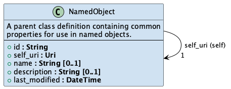
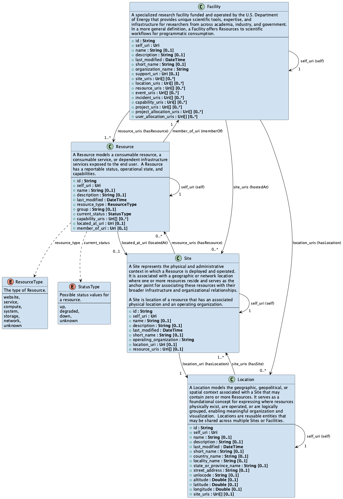
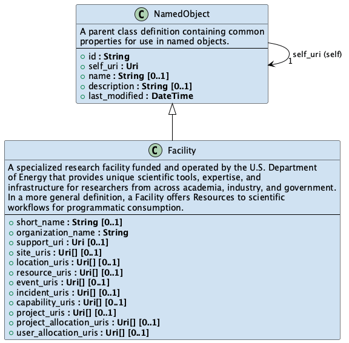
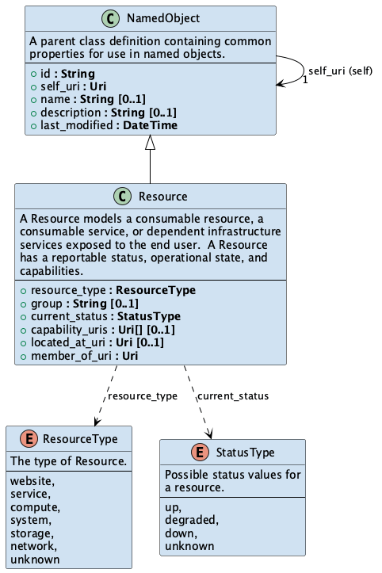
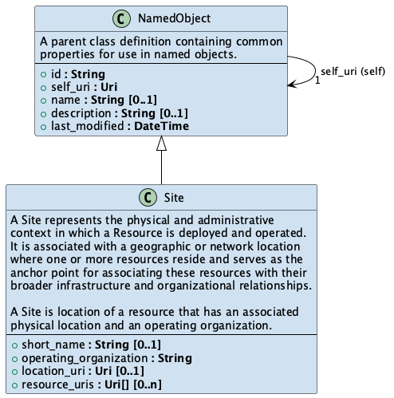
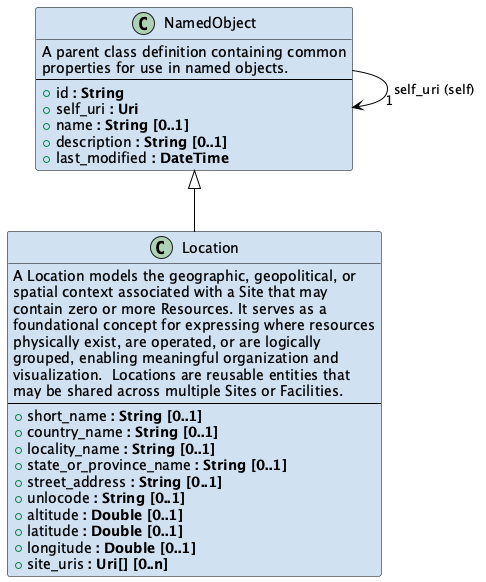
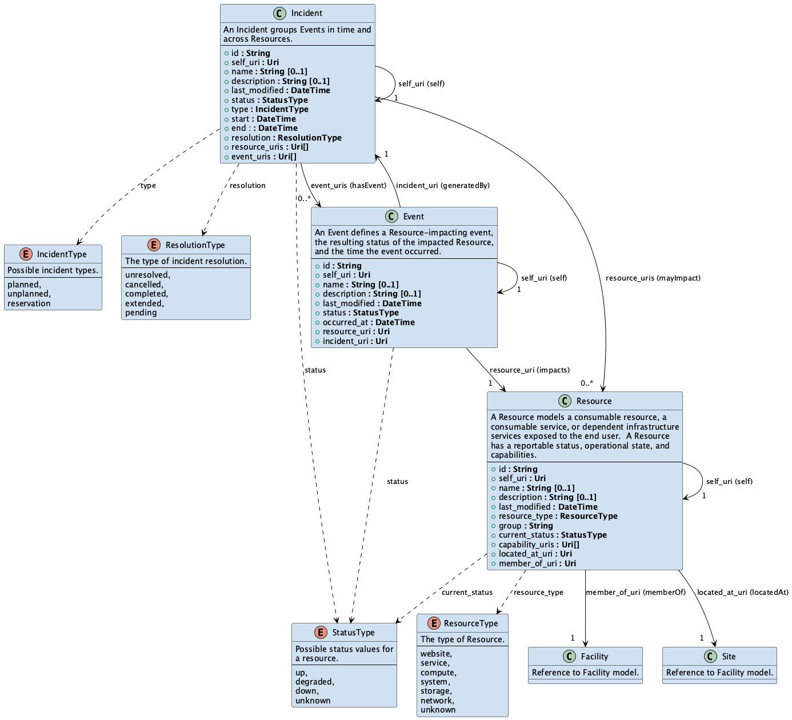
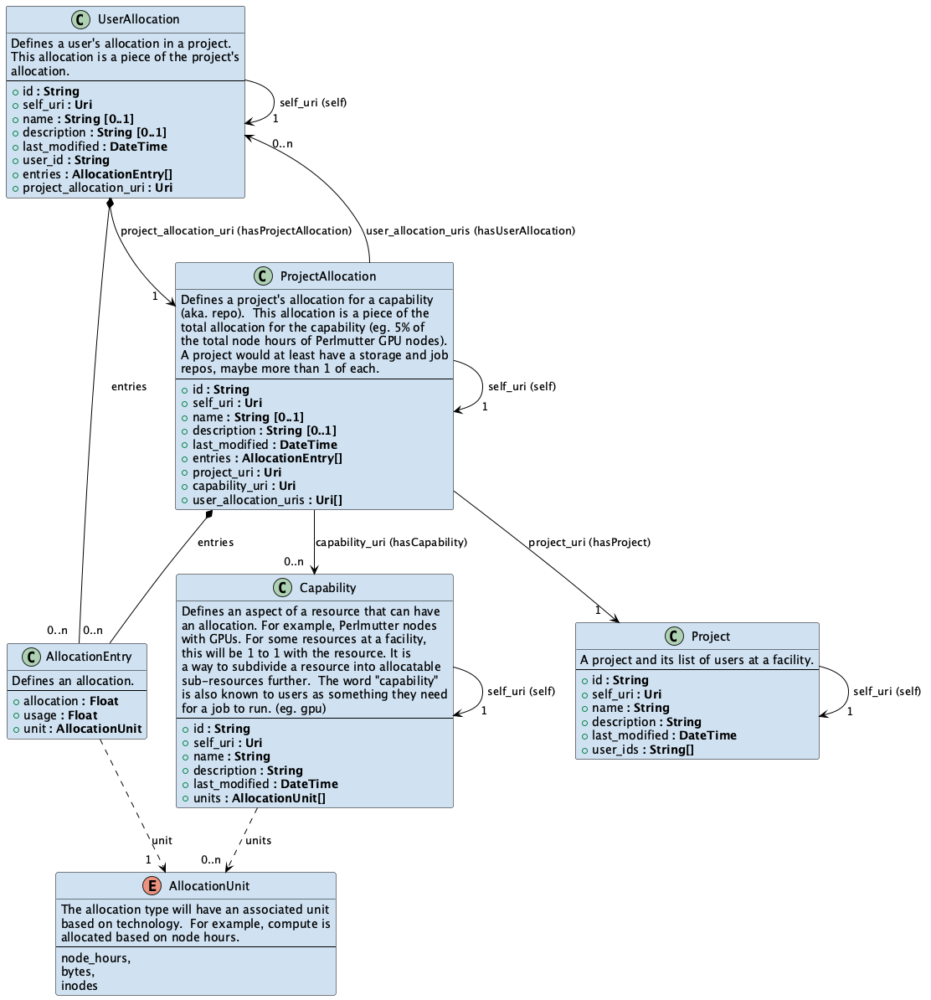
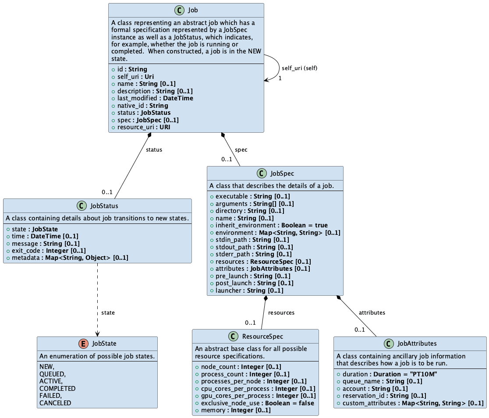

# 6. Conceptual Model
The IRI conceptual model is an ever expanding set of functionalities needed to provide users with access
to capabilities at the DoE User Facilities.  Initially targeting scientific workflows, and now expanded
to incorporate the needs of the American Science Cloud, the IRI conceptual model is the basis for 
development of programmatic interfaces into the DoE user facilities.  This section describes the 
conceptual model in its current state.

The IRI conceptual model currently consists of five interconnected models: Facility, Status, Allocation, 
Job, and Filesystem.  These classes serve as the foundational entities for describing physical 
infrastructure, service components, operational occurrences, administrative context, job 
distribution, and filesystem manipulation.

  - The <b>Facility model</b> defines the core structure for representing organizational information
(Facility, Resources, Sites, Locations) across the IRI distributed infrastructure.
  - The <b>Status model</b> defines
the core structure for representing operational information for a Facility (Incidents, Events, and impacted
Resources).
  - The <b>Allocation model</b> defines user and project allocations at a Facility allowing an
application to determine if, from an accounting perspective, can store data or run a job at a site
(UserAllocation, ProjectAllocation, Project, and Capability).
- The <b>Job model</b> defines Job related classes (Job, JobSpec, JobStatus) for specification and 
management of the invocation of application executables on exascale machines.  This specification is
based off of the [ExWorks PSI/J](https://exaworks.org/) job management model.
- The <b>Filesystem model</b>

Each class encapsulates key attributes and behaviors relevant to its domain. 

In addition to defining these object types, the model includes a set of well-defined relationships 
and cardinalities that govern how instances of these classes are interconnected. These relationships 
capture structural, functional, and temporal associations (e.g., a Resource belongs to a Site, an 
Event is part of an Incident, an Event impacts a Resource, a Facility is hosted at one or more Sites), 
enabling rich semantic navigation across the model. Cardinality constraints ensure precision in how 
many instances can or must participate in a given relationship, supporting both validation and query 
optimization.

---

## 6.1 NamedObject
The NamedObject is a foundational object class that defines a common set of descriptive and identifying
attributes shared by named object types (a named object is directly referencable through the API). It 
provides a consistent structure for naming, referencing, and describing objects across diverse facilities 
and systems. By standardizing these core properties, NamedObject ensures uniformity in how objects are 
identified, linked, and maintained within distributed infrastructures.

The NamedObject class has the following definition:

    

<b>Figure 6.11 - NamedObject class.</b>

## 6.1.1 Attributes
The NamedObject class has the attribute definitions:

| Attribute     | Type                                     | Description                                                                                                    | Required | Cardinality | Example                                                                                                                   |
|:--------------|:-----------------------------------------|:---------------------------------------------------------------------------------------------------------------|:---------|:------------|:--------------------------------------------------------------------------------------------------------------------------------------|
| id            | String                                   | The unique identifier for the object.  Typically a UUID or URN to provide global uniqueness across facilities. | yes      | 1           | 09a22593-2be8-46f6-ae54-2904b04e13a4                                                                                                  |
| self_uri      | Uri                                      | A “self” relationship link.                                                                                    | yes      | 1           | "https://iri.example.com/api/v1/facility"                                                                                             |
| name          | String                                   | The long name of the object.                                                                                   | no       | 0..1        | Lawrence Berkeley National Laboratory                                                                                                 |
| description   | String                                   | A description of the object.                                                                                   | no       | 0..1        | Lawrence Berkeley National Laboratory is charged with conducting unclassified research across a wide range of scientific disciplines. |
| last_modified | ISO 8601 standard with timezone offsets. | The date this object was last modified.                                                                        | yes      | 1           | 2025-05-11T20:34:25.272Z |

Any object that can be addressable directly through the API should inherit the attributes of this class.
The inheritance relationship is not shown in the consolidated model diagrams for simplicity, but the 
attributes are included.

## 6.1.2 Relationships
The NamedObject has a well-defined "self" relationship that allows for navigation to the instance 
of the NamedObject.

| Source       | Relationship | Destination  | Cardinality | Description                              |
|:-------------|:-------------|:-------------|:------------|:-----------------------------------------|
| NamedObject  | self         | NamedObject  | 1           | A NamedObject has a reference to itself. |

---

## 6.2 Facility Model
The Facility model (see Figure 1) defines the core structure for representing organizational information
across the IRI distributed infrastructure. It is composed of four primary classes of named objects:
Facility, Site, Location, and Resource.  Each class encapsulates key attributes and behaviors relevant 
to its domain. These classes serve as the foundational entities for describing physical infrastructure, 
service components, and administrative context.

    

<b>Figure 6.2 - Facility Model.</b>

These object definitions enable users and systems to traverse the Facility model dynamically, answering 
questions such as "Which resources of type xyx are hosted at this Facility?" or "Which resources are 
located at a specific site?"

### 6.2.1 Facility
A specialized research facility funded and operated by the U.S. Department of Energy that provides 
unique scientific tools, expertise, and infrastructure for researchers from across academia, 
industry, and government. In a more general definition, a `Facility` offers `Resources` to scientific
workflows for programmatic consumption.

    

<b>Figure 6.2.1 - Facility class.</b>

The `Facility` class has the following attribute definitions:

| Attribute                 | Type     | Description                                                | Required | Cardinality | Example                                                                                             |
|:--------------------------|:---------|:-----------------------------------------------------------|:---------|:------------|-----------------------------------------------------------------------------------------------------|
| `id`                      | String   | Unique identifier (UUID) for the `Facility`.               | yes      | 1           | `09a22593-2be8-46f6-ae54-2904b04e13a4`                                                              |
| `self_uri`                | URI      | Canonical hyperlink to this `Facility`.                    | yes      | 1           | `https://iri.example.com/api/v1/facility`                                                           |
| `name`                    | String   | Long name of the `Facility`.                               | yes      | 0..1        | `National Energy Research Scientific Computing Center`                                              |
| `description`             | String   | Human‑readable description for this `Facility`.            | no       | 0..1        | `NERSC is the mission scientific computing facility for the U…`                                     |
| `last_modified`           | DateTime | Timestamp (ISO 8601) when this Facility was last modified. | yes      | 1           | `2025-10-15T01:00:50.000Z`                                                                          |
| `short_name`              | String   | Common/short name of the `Facility`.                       | no       | 0..1        | `NERSC`                                                                                             |
| `organization_name`       | String   | Operating organization’s name.                             | no       | 0..1        | `Lawrence Berkeley National Laboratory`                                                             |
| `support_uri`             | URI      | Link to `Facility` support portal.                         | no       | 0..1        | `https://help.nersc.gov/`                                                                           |
| `site_uris`               | URI[]    | URIs of associated `Sites` (hasSite).                      | no       | 0..*        | [`https://iri.example.com/api/v1/facility/sites/ce2bbc49-ba63-4711-8f36-43b74ec2fe45`]              |
| `location_uris`           | URI[]    | URIs of associated `Locations` (hasLocation).              | no       | 0..*        | [`https://iri.example.com/api/v1/facility/locations/b1c7773f-4624-4787-b1e9-46e1c78c3320`]          |
| `resource_uris`           | URI[]    | URIs of contained `Resources` (hasResource).               | no       | 0..*        | [`https://iri.example.com/api/v1/status/resources/289d38f2-e93c-4840-b037-8b78d8ec36cc`]            |
| `event_uris`              | URI[]    | URIs of `Events` in this Facility (hasEvent).              | no       | 0..*        | [`https://iri.example.com/api/v1/status/events/f9d6e700-1807-45bd-9a52-e81c32d40c5a`]               |
| `incident_uris`           | URI[]    | URIs of `Incidents` in this Facility (hasIncident).        | no       | 0..*        | [`https://iri.example.com/api/v1/status/incidents/686efb0a-0f85-4cc9-86a3-f5713ee6ea44`]            |
| `capability_uris`         | URI[]    | URIs of `Capability` offered by the Facility.              | no       | 0..*        | [`https://iri.example.com/api/v1/account/capabilities/9b930fc2-7840-47b2-9268-42362b6fe9ee`]        |
| `project_uris`            | URI[]    | URIs of `Projects` associated to this Facility.            | no       | 0..*        | [`https://iri.example.com/api/v1/account/projects/d6bdb597-8393-4747-8f90-6db08ae018ac`]            |
| `project_allocation_uris` | URI[]    | URIs of `ProjectAllocation`.                               | no       | 0..*        | [`https://iri.example.com/api/v1/account/project_allocations/46dcde57-e88a-49a9-bf7a-c2120cf5a86b`] |
| `user_allocation_uris`    | URI[]    | URIs of `UserAllocation`.                                  | no       | 0..*        | [`https://iri.example.com/api/v1/account/user_allocations/be91d9c1-99bc-47c1-aaa9-3ee82bb8a7d0`]    |

### 6.2.2 Resource
A `Resource` models a consumable resource, a consumable service, or dependent infrastructure
services exposed to the end user.  A `Resource` has a reportable status, operational state, and
capabilities.

    

<b>Figure 6.2.2 - Resource class.</b>

The `Resource` class has the following attribute definitions:

| Attribute            | Type         | Description                                                                                                                                                                                                        | Required | Cardinality | Example                                                                                                                                       |
|:---------------------|:-------------|:-------------------------------------------------------------------------------------------------------------------------------------------------------------------------------------------------------------------|:---------|:------------|:----------------------------------------------------------------------------------------------------------------------------------------------|
| `id`                 | String       | The unique identifier for the `Resource`.  Typically a UUID or URN to provide global uniqueness across facilities.                                                                                                 | yes      | 1           | "09a22593-2be8-46f6-ae54-2904b04e13a4"                                                                                                        |
| `self_uri`           | URI          | A hyperlink reference (URI) to this `Resource` (self). Canonical hyperlink to this `Resource`.                                                                                                                                                            | yes      | 1           | "https://iri.example.com/api/v1/status/resources/09a22593-2be8-46f6-ae54-2904b04e13a4"                                                        |
| `name`               | String       | The long name of the `Resource`.                                                                                                                                                                                   | no       | 0..1        | "Data Transfer Nodes"                                                                                                                         |
| `description`        | String       | A description of the `Resource`.                                                                                                                                                                                   | no       | 0..1        | "The NERSC data transfer nodes provide access to Global Homes, Global Common, the Community File System (CFS), Perlmutter Scratch, and HPSS." |
| `last_modified`      | DateTime     | The date this `Resource` was last modified.  ISO 8601 standard with timezone offsets.                                                                                                                              | no       | 0..1        | "2025-07-24T02:31:13.000Z"                                                                                                                    |
| `resource_type`      | ResourceType | The type of `Resource` based on string ENUM values.                                                                                                                                                                | yes      | 1           | "compute"                                                                                                                                     |
| `group`              | String       | The member `Resource` group.                                                                                                                                                                                       | no       | 0..1        | "perlmutter" |
| `current_status`     | StatusType   | The current status of this `Resource` at time of query based on string ENUM values. If there is no last Event associated with the resource to indicate a current status, then currentStatus defaults to "unknown". | yes      | 1           | "up"                                                                                                                                          |
| `capability_uris`    | String[]     | Hyperlink references (URIs) to capabilities this `Resource` provides (hasCapability).                                                                                                                              | no       | 0..*        | ["https://iri.example.com/api/v1/account/capabilities/b1ce8cd1-e8b8-4f77-b2ab-152084c70281"]                                                  |
| `located_at_uri`     | URI          | A hyperlink reference (URI) to the `Site` containing this `Resource` (locatedAt).                                                                                                                                  | no       | 0..1        | "https://iri.example.com/api/v1/facility/sites/ce2bbc49-ba63-4711-8f36-43b74ec2fe45"                                                          |
| `member_of_uri`      | URI          | A hyperlink reference (URI) to `Facility` managing this `Resource` (memberOf).                                                                                                                                         | no       | 0..1        | "https://iri.example.com/api/v1/facility"                                                                                                     |

### 6.2.3 Site
A `Site` represents the physical and administrative context in which a `Resource` is deployed and operated.
It is associated with a geographic or network location  where one or more resources reside and serves as the
anchor point for associating these resources with their broader infrastructure and organizational relationships.

A `Site` is location of a resource that has an associated physical location and an operating organization.

    

<b>Figure 6.2.3 - Site class.</b>

The `Site` class has the following attribute definitions:

| Attribute                            | Type     | Description                                                                                                                                                   | Required | Cardinality | Example                                                                                  |
|:-------------------------------------|:---------|:--------------------------------------------------------------------------------------------------------------------------------------------------------------|:---------|:------------|:-----------------------------------------------------------------------------------------|
| `id`                                 | String   | The unique identifier for the `Site`.  Typically a UUID or URN to provide global uniqueness across facilities.                                                | yes      | 1           | "ce2bbc49-ba63-4711-8f36-43b74ec2fe45"                                                   |
| `self_uri`                           | URI      | A hyperlink reference (URI) to this `Shelf` (self). Canonical hyperlink to this `Shelf`.                                                                      | yes      | 1           | "https://iri.example.com/api/v1/facility/sites/ce2bbc49-ba63-4711-8f36-43b74ec2fe45"       |
| `name`                               | String   | The long name of the `Site`.                                                                                                                                  | no       | 0..1        | "Lawrence Berkeley National Laboratory Building 59"                                                                    |
| `description`                        | String   | A description of the `Site`.                                                                                                                                  | no       | 0..1        | "Level3 CLLI BKLYCACE, ESNETWEST at LBNL59."                                             |
| `last_modified`                      | DateTime | The date this `Site` object was last modified, including modification of any attributes or links. Format follows the ISO 8601 standard with timezone offsets. | no       | 0..1        | "2025-07-24T02:31:13.000Z"                                                               |
| `short_name`                         | String   | Common/short name of the `Site`.                                                                                                                              | no       | 0..1        | `LBNL59`                                                                                 |
| `operating_organization`             | String   | The name of the organization operating the `Site`.                                                                                                            | yes      | 1           | "Lawrence Berkeley National Laboratory"                                                  |
| `location_uri`                       | URI      | A hyperlink reference (URI) to the `Location` containing this Site (hasLocation).                                                                             | no       | 0..1        | "https://iri.example.com/api/v1/facility/locations/ce2bbc49-ba63-4711-8f36-43b74ec2fe45" |
| `resource_uris`                      | URI[]    | A hyperlink reference (URI) to the `Resource` located at this `Site` (hasResource).                                                                           | no       | 0..*        | "https://iri.example.com/api/v1/facility/resources/289d38f2-e93c-4840-b037-8b78d8ec36cc"                                               |

### 6.2.4 Location
A `Location` models the geographic, geopolitical, or spatial context associated with a `Site` that may
contain zero or more `Resources`. It serves as a foundational concept for expressing where resources
physically exist, are operated, or are logically grouped, enabling meaningful organization and
visualization.  `Location`s are reusable entities that may be shared across multiple `Sites` or `Facilities`.

    

<b>Figure 6.2.4 - Location class.</b>

The `Location` class has the following attribute definitions:

| Attribute                | Type     | Description                                                                                                                                                   | Required | Cardinality | Example                                                                                  |
|:-------------------------|:---------|:--------------------------------------------------------------------------------------------------------------------------------------------------------------|:---------|:------------|:-----------------------------------------------------------------------------------------|
| `id`                     | String   | The unique identifier for the `Location`.  Typically a UUID or URN to provide global uniqueness across facilities.  | yes      | 1           | "ce2bbc49-ba63-4711-8f36-43b74ec2fe45"                                                   |
| `self_uri`               | URI      | A hyperlink reference (URI) to this `Location` (self). Canonical hyperlink to this `Location`.  | yes      | 1           | "https://iri.example.com/api/v1/status/sites/ce2bbc49-ba63-4711-8f36-43b74ec2fe45"       |
| `name`                   | String   | The long name of the `Location`. | no       | 0..1        | "Lawrence Berkeley National Laboratory"                                                                    |
| `description`            | String   | A description of the `Location`. | no    | 0..1        | "Lawrence Berkeley National Laboratory is charged with conducting unclassified research across a wide range of scientific disciplines."                                             |
| `last_modified`          | DateTime | The date this `Location` object was last modified, including modification of any attributes or links. Format follows the ISO 8601 standard with timezone offsets. | no    | 0..1        | "2025-07-24T02:31:13.000Z"                                                               |
| `short_name`             | String   | Common/short name of the `Location`. | no       | 0..1        | `LBNL59` |
| `country_name`           | String   | The country name of the `Location`. | no       | 0..1        | `United States of America` |
| `locality_name`          | String   | The city or locality name of the `Location`. | no       | 0..1        | `Berkeley` |
| `state_or_province_name` | String   | The state or province name of the `Location`. | no       | 0..1        | `California` |
| `street_address`         | String   | The street address of the `Location`. | no       | 0..1        | `1 Cyclotron Rd, Building 59 Room 2102` |
| `unlocode`               | String   | The United Nations code for trade and transport `Location`. | no       | 0..1        | `US JBK` |
| `altitude`               | Float   | The altitude of the `Location`. | no       | 0..1        | 240 |
| `latitude`               | Float   | The latitude of the `Location`. | no       | 0..1        | 37.87492 |
| `longitude`              | Float   | The longitude of the `Location`. | no       | 0..1        | -122.2529 |
| `site_uris`              | URI[]    | A hyperlink reference (URI) to the `Resource` located at this `Site` (hasResource). | no    | 0..*   | ["http://localhost:8081/api/v1/facility/sites/ce2bbc49-ba63-4711-8f36-43b74ec2fe45"]                                               |

### 6.2.5 Relationships
The Facility model has a set of well-defined relationships and their cardinalities that allows
for navigation between objects based on relationship type.  The following table describes these
relationships.

| Source     | Relationship  | Destination | Cardinality | Description                                                                        |
|:-----------|:--------------|:------------|:------------|:-----------------------------------------------------------------------------------|
| Facility   | hasLocation   | Location    | 0..*        | A Facility can be associated with one or more geographical Locations.              |
| Facility   | hostedAt      | Site        | 0..*        | A Facility can be hosted at one or more physical Sites.                            |
| Facility   | hasResource   | Resource    | 1..*        | A Facility can host zero or more Resources.                                        |
| Facility   | self          | Facility    | 1           | A Facility has a reference to itself.                                              |
| Resource   | memberOf      | Facility    | 1           | A Resource is a member of one of more Facilities (allowing for a shared resource). |
| Resource   | locatedAt     | Site        | 0..1        | A Resource is located at one Site.                                                 |
| Resource   | self          | Resource    | 1           | A Resource has a reference to itself.                                              |
| Site       | hasResource   | Resource    | 0..*        | A Site hosts zero or more Resources.                                               |
| Site       | locatedAt     | Location    | 0..1        | A Site is located at a geographic location.                                        |
| Site       | self          | Site        | 1           | A Site has a reference to itself.                                                  |
| Location   | hasSite       | Site        | 1..*        | A Location can contain one or more Sites.                                          |
| Location   | self          | Location    | 1           | A Location has a reference to itself.                                              |

---

## 6.3 Status Model
The Status model (see Figure 2) defines the core structure for representing operational information across 
the IRI distributed infrastructure. It is composed of three primary classes of named objects: Incident, 
Event, and Resource.  Each class encapsulates key attributes and behaviors relevant to the communication of
operational status. These classes serve as the foundational entities for describing a facility's operational 
impacts and administrative context on defined Resources.

<b>Figure 2 - Status Model.</b>

These object definitions enable users and systems to traverse the Status model dynamically, answering
questions such as "What incidents have affected this facility and which resources are impacted?", or 
"Which events were logged during a specific outage?”.

The Status model has a set of well-defined relationships and their cardinalities that allows
for navigation between objects based on relationship type.  The following table describes these
relationships.

| Source | Relationship | Destination | Description |
| :---- | :---- | :---- | :---- |
| Incident | hasEvent | Event | A Facility has one or more associated Events. |
| Incident | mayImpact | Resource | An Incident may impact one or more Resources. |
| Incident | self | Incident | An Incident has a reference to itself. |
| Event | generatedBy | Incident | An Event is generated by an Incident. |
| Event | impacts | Resource | An Event impacts a Resource. |
| Event | self | Event | An Event has a reference to itself. |
| Resource | impactedBy | Event | A Resource is impacted by zero or more Events. |
| Resource | hasIncident | Incident | A Resource is impacted by zero or more Incidents. |

---

## 6.4 Allocation Model

<b>Figure 4 - Allocation Model.</b>

---

## 6.5 Job Model

<b>Figure 5 - Job Model.</b>

---

## 6.6 Relationships

The Facility and Status model has a set of well-defined relationships and their cardinalities that allows
for navigation between objects based on relationship type.  The following table describes these
relationships.

| Source | Relationship | Destination | Description |
| :---- | :---- | :---- | :---- |
| Facility | hasLocation | Location | A Facility can be associated with one or more geographical Locations. |
| Facility | hostedAt | Site | A Facility can be hosted at one or more physical Sites. |
| Facility | hasIncident | Incident | A Facility can have zero or more Incidents. |
| Facility | hasEvent | Event | A Facility can have zero or more Events caused by Incidents. |
| Facility | hasResource | Resource | A Facility can host zero or more Resources. |
| Facility | self | Facility | A Facility has a reference to itself. |
| Incident | hasEvent | Event | A Facility has one or more associated Events. |
| Incident | mayImpact | Resource | An Incident may impact one or more Resources. |
| Incident | self | Incident | An Incident has a reference to itself. |
| Event | generatedBy | Incident | An Event is generated by an Incident. |
| Event | impacts | Resource | An Event impacts a Resource. |
| Event | self | Event | An Event has a reference to itself. |
| Resource | impactedBy | Event | A Resource is impacted by zero or more Events. |
| Resource | hasIncident | Incident | A Resource is impacted by zero or more Incidents. |
| Resource | memberOf | Facility | A Resource is a member of one of more Facilities (allowing for a shared resource). |
| Resource | locatedAt | Site | A Resource is located at one Site. |
| Resource | dependsOn | Resource | A Resource can depend on zero or more Resources. |
| Resource | hasDependent | Resource | A Resource can have zero or more dependent Resources. |
| Resource | self | Resource | A Resource has a reference to itself. |
| Site | hasResource | Resource | A Site hosts zero or more Resources. |
| Site | locatedAt | Location | A Site is located at a geographic location. |
| Site | self | Site | A Site has a reference to itself. |
| Location | hasSite | Site | A Location can contain one or more Sites. |
| Location | self | Location | A Location has a reference to itself. |
