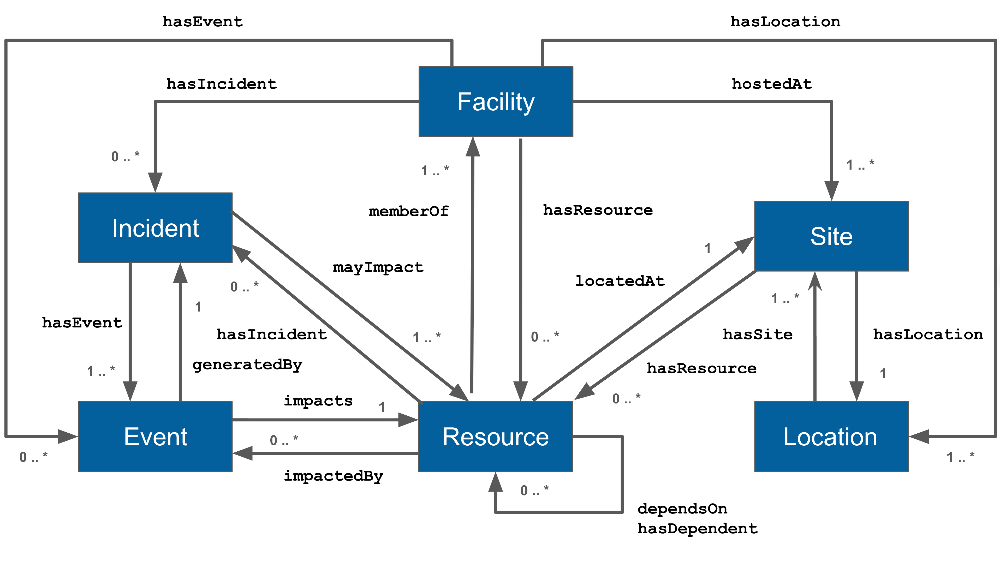

# 6. Model
The Facility and Status model (see Figure 1) defines the core structure for representing operational
and organizational information across the IRI distributed infrastructure. It is composed of six 
primary classes of named objects: Facility, Site, Location, Incident, Event, and Resource.  Each 
class encapsulates key attributes and behaviors relevant to its domain. These classes serve as the 
foundational entities for describing physical infrastructure, service components, operational 
occurrences, and administrative context.

In addition to defining these object types, the model includes a set of well-defined relationships 
and cardinalities that govern how instances of these classes are interconnected. These relationships 
capture structural, functional, and temporal associations (e.g., a Resource belongs to a Site, an 
Event is part of an Incident, an Event impacts a Resource, a Facility is hosted at one or more Sites), 
enabling rich semantic navigation across the model. Cardinality constraints ensure precision in how 
many instances can or must participate in a given relationship, supporting both validation and query 
optimization.

Together, these elements enable users and systems to traverse the model dynamically, answering 
questions such as "What incidents have affected this facility and which resources are impacted?",
"Which resources are located at this site?", or "Which events were logged during a specific 
outage?”.

<b>Figure 1 - Facility and Status Model.</b>

## 6.1 Relationships

The Facility and Status model has a set of well-defined relationships and their cardinalities that allows 
for navigation between objects based on relationship type.  The following table describes these 
relationships.  

| Source | Relationship | Destination | Description |
| :---- | :---- | :---- | :---- |
| Facility | hasLocation | Location | A Facility can be associated with one or more geographical Locations. |
| Facility | hostedAt | Site | A Facility can be hosted at one or more physical Sites. |
| Facility | hasIncident | Incident | A Facility can have zero or more Incidents. |
| Facility | hasEvent | Event | A Facility can have zero or more Events caused by Incidents. |
| Facility | hasResource | Resource | A Facility can host zero or more Resources. |
| Facility | self | Facility | A Facility has a reference to itself. |
| Incident | hasEvent | Event | A Facility has one or more associated Events. |
| Incident | mayImpact | Resource | An Incident may impact one or more Resources. |
| Incident | self | Incident | An Incident has a reference to itself. |
| Event | generatedBy | Incident | An Event is generated by an Incident. |
| Event | impacts | Resource | An Event impacts a Resource. |
| Event | self | Event | An Event has a reference to itself. |
| Resource | impactedBy | Event | A Resource is impacted by zero or more Events. |
| Resource | hasIncident | Incident | A Resource is impacted by zero or more Incidents. |
| Resource | memberOf | Facility | A Resource is a member of one of more Facilities (allowing for a shared resource). |
| Resource | locatedAt | Site | A Resource is located at one Site. |
| Resource | dependsOn | Resource | A Resource can depend on zero or more Resources. |
| Resource | hasDependent | Resource | A Resource can have zero or more dependent Resources. |
| Resource | self | Resource | A Resource has a reference to itself. |
| Site | hasResource | Resource | A Site hosts zero or more Resources. |
| Site | locatedAt | Location | A Site is located at a geographic location. |
| Site | self | Site | A Site has a reference to itself. |
| Location | hasSite | Site | A Location can contain one or more Sites. |
| Location | self | Location | A Location has a reference to itself. |

## 6.2 Facility Model

<b>Figure 2 - Facility Model.</b>

## 6.3 Status Model

<b>Figure 3 - Status Model.</b>

## 6.4 Allocations Model

<b>Figure 4 - Allocation Model.</b>

## 6.5 Job Model

<b>Figure 5 - Job Model.</b>
